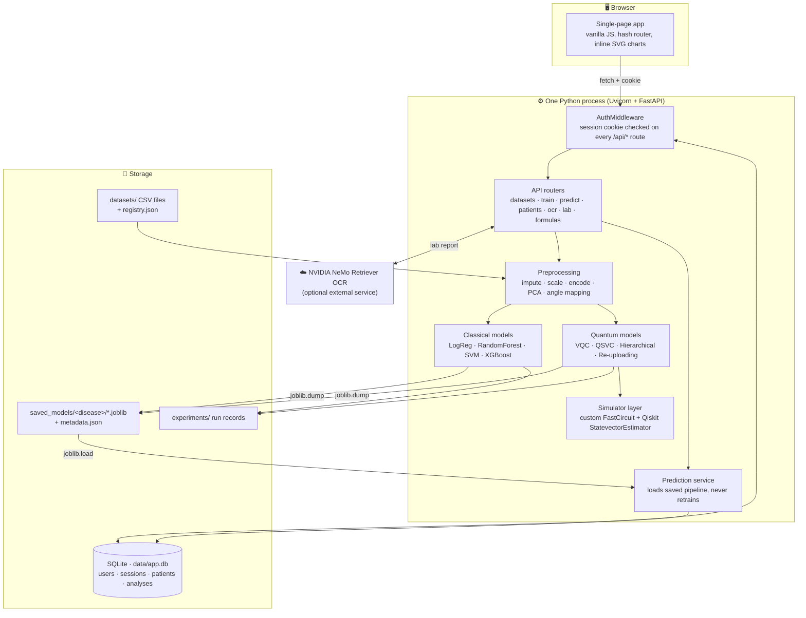
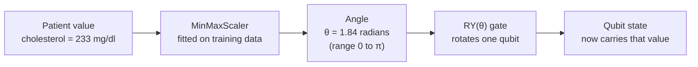
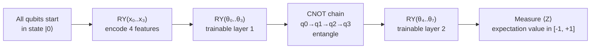
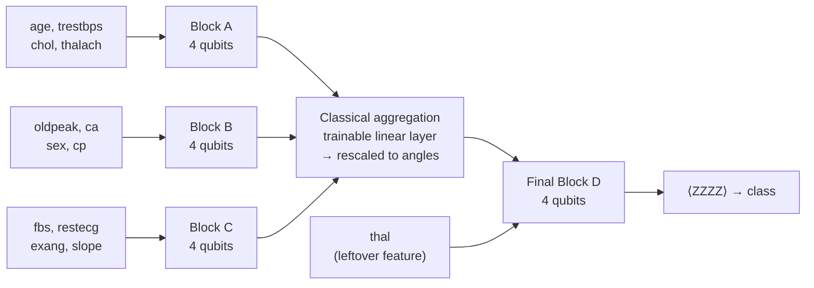
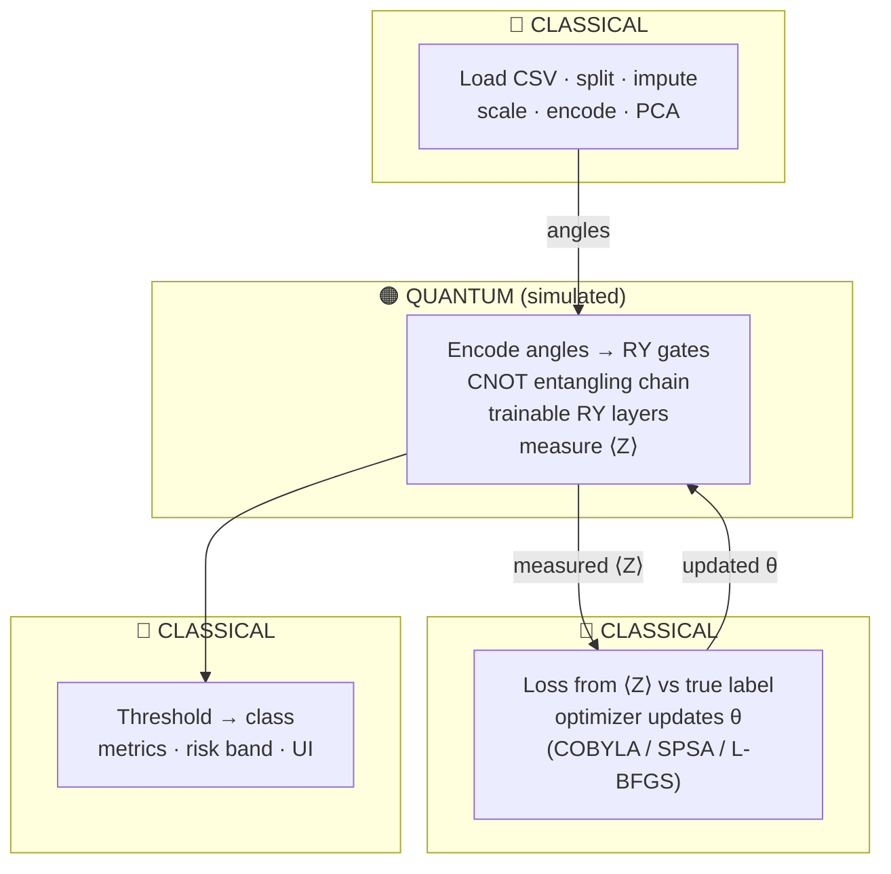
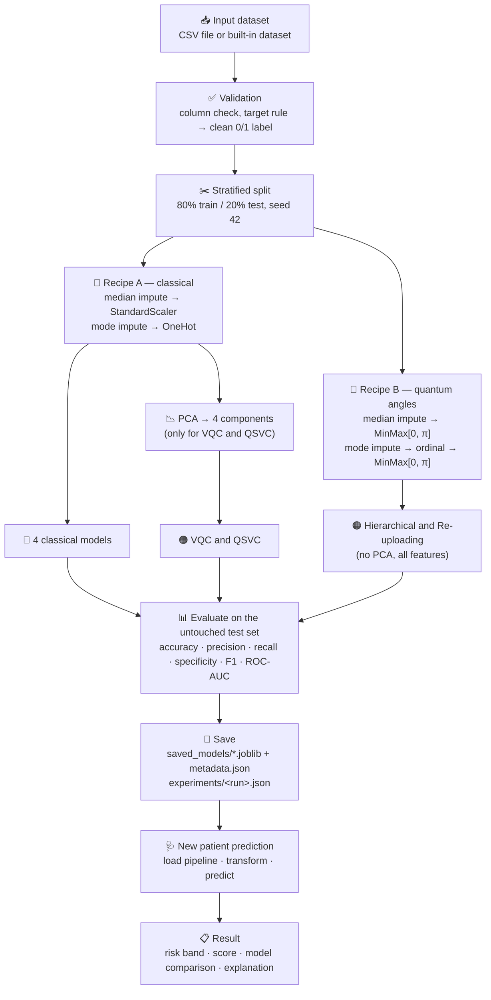

# Quantum Care

### Hybrid Quantum-Classical Machine Learning Platform for Early Disease Prediction

> **Smart India Hackathon — research prototype**
> A working web application that trains **classical** and **quantum** machine-learning models on the **same medical dataset, the same split and the same preprocessing**, then uses the saved models to produce a risk prediction for a single patient.

**Quantum Care is an honest side-by-side experiment.** Most "quantum ML" demos show only a quantum model. We run four classical models and four quantum models on identical data and publish whatever numbers come out — including the many cases where the classical model wins.

The platform is a **single Python process** that serves both the API and the web interface. A doctor or operator signs in, picks a disease, fills a patient form (or uploads a lab report for OCR), and receives a risk estimate from models that were trained earlier and saved to disk. Nothing is retrained at prediction time.

All quantum computation runs on an **exact, noiseless simulator on a normal laptop**. We do **not** use real quantum hardware, and we do **not** claim any quantum advantage.

> ⚠️ **This is a research and educational prototype. It is not a medical device, it is not clinically validated, and its output is not a diagnosis.** See the [Healthcare Disclaimer](#19--healthcare-disclaimer).

---

## 📑 Table of Contents

| | Section | | Section |
|---|---|---|---|
| 1 | [Problem Statement](#1--problem-statement) | 11 | [Project Structure](#11--project-structure) |
| 2 | [Our Solution](#2--our-solution) | 12 | [Technical Implementation](#12--technical-implementation) |
| 3 | [Key Features](#3--key-features) | 13 | [Running the Application](#13--running-the-application) |
| 4 | [How the Application Works](#4--how-the-application-works) | 14 | [Current Implementation](#14--current-implementation) |
| 5 | [System Architecture](#5--system-architecture) | 15 | [Results / Evaluation](#15--results--evaluation) |
| 6 | [Quantum Machine Learning](#6--quantum-machine-learning) | 16 | [Limitations](#16--limitations) |
| 7 | [Classical ML vs Quantum ML](#7--classical-ml-vs-quantum-ml) | 17 | [Future Scope](#17--future-scope) |
| 8 | [Data Pipeline](#8--data-pipeline) | 18 | [Why This Approach](#18--why-this-approach) |
| 9 | [Application Screenshots](#9--application-screenshots) | 19 | [Healthcare Disclaimer](#19--healthcare-disclaimer) |
| 10 | [Technology Stack](#10--technology-stack) | | |

---

## 1 · Problem Statement

Medical risk datasets are small, messy, and full of features that interact with each other.

A single patient record for heart disease has **13 different measurements** — age, blood pressure, cholesterol, ECG result, chest-pain type, and more. Risk does not come from any one of them. It comes from **combinations**: high cholesterol matters differently for a 40-year-old than for a 70-year-old with exercise-induced angina.

**Three practical problems:**

| Problem | Why it matters |
|---|---|
| **Feature interactions are hard to model** | Classical models handle them, but each family (linear, tree, kernel) captures a different kind of interaction, and none is best for every dataset. |
| **Medical datasets are small** | The UCI Cleveland dataset has **303 rows**. With so little data, a single train/test split can move accuracy by several points just by changing the random seed. |
| **New model families are untested here** | Quantum machine learning is claimed to represent feature interactions differently. Almost nobody tests that claim on clinical tabular data with a fair, leakage-free setup. |

**What Quantum Care actually asks:**

> Can a small quantum circuit be built into a normal medical ML pipeline, and how does it *actually* score when measured against strong classical baselines on identical data?

We do not claim quantum computing improves healthcare outcomes. We built the platform that lets the question be measured honestly.

---

## 2 · Our Solution

Quantum Care is a complete web application that runs the whole experiment end to end.

```
USER  →  DATA  →  PROCESSING  →  MODELS  →  PREDICTION  →  RESULT
```

| Stage | What actually happens |
|---|---|
| **User** | An operator signs in with a username and password. Every API route is protected. |
| **Data** | Pick one of 4 built-in medical datasets, or upload your own CSV through a guided wizard. |
| **Processing** | The data is split into train/test, then cleaned — missing values filled, numbers scaled, categories encoded. Every statistic is learned from the **training half only**. |
| **Models** | **8 models** are trained on the same split: 4 classical + 4 quantum. Each is scored on the untouched test half. |
| **Prediction** | For a new patient, the saved model file is loaded and the patient's numbers are pushed through it. **No retraining.** |
| **Result** | A risk level, a score, a comparison across all 8 models, and — where the maths allows it — which measurements pushed the score up or down. |

Two workflows sit side by side in the same application:

* 🩺 **Clinical workflow** — register/verify a patient, enter their data (form, OCR, or manual), get a prediction, save it to their record.
* 🔬 **Research workflow** — upload a dataset, inspect it, train all 8 models, compare classical vs quantum on charts and tables, inspect the quantum circuits.

---

## 3 · Key Features

| | Feature | What it does |
|---|---|---|
| ⚖️ 1. | **Fair 8-model benchmark** | 4 classical + 4 quantum models, identical split, identical preprocessing, identical metrics. |
| ⚛️ 2. | **Four different quantum models** | Not one token circuit — a VQC, a quantum-kernel SVM, a hierarchical block model, and a data re-uploading model. |
| 🔒 3. | **Leakage-safe by construction** | Preprocessing lives *inside* the scikit-learn Pipeline, so it can only ever be fitted on training data. |
| 💨 4. | **Custom fast simulator** | A vectorised statevector engine for RY/CX circuits, verified equal to Qiskit's own simulator to **1e-10**. |
| 📄 5. | **NVIDIA OCR intake** | Upload a lab report (JPG/PNG/PDF); values are extracted and mapped onto the model's input fields for human confirmation. |
| 👤 6. | **Patient records + email OTP** | Patients are registered once with a verified email, then reused across many analyses. |
| 🧠 7. | **Honest explainability** | Exact per-patient contributions where the model supports it, and an explicit "not available" where it does not. |
| 📚 8. | **Password-protected formula section** | Every formula used in the project, tagged *implemented* or *theoretical*, with a worked example on real saved numbers. |
| 🧪 9. | **53 automated tests** | Including a test that the quantum simulator matches Qiskit, and that analytic gradients match finite differences. |

---

## 4 · How the Application Works

### Step 1 — User Input

The operator signs in (session cookie, checked by middleware on every request), then chooses a path:

* **Pick a disease** from the dashboard — Heart Disease (Cleveland), Diabetes (Pima), Breast Cancer (Wisconsin), or a synthetic heart dataset.
* **Enter a patient** — a new patient (verified by an emailed 6-digit code), an existing patient by ID/name/phone, or a one-off manual entry with no record saved.
* **Enter the measurements** — either type them into the form, or upload a lab report and let OCR read them.

The form itself is **not hard-coded**. It is generated from the dataset's configuration (`DiseaseSpec`), so the fields, units, dropdown options and valid ranges always match exactly what the trained model expects.

### Step 2 — Data Processing

**For a dataset (training):** the CSV is loaded, the target column is converted to a clean 0/1 label using a documented rule, and rows are split **80/20 with stratification** (the same proportion of positive cases in both halves), using a fixed seed of 42.

**For one patient (prediction):** the submitted values are validated against the form schema — wrong types, out-of-range numbers and unknown fields are rejected or flagged before anything reaches a model.

> 🔑 **The critical rule:** the test half is never touched during training. Every average, scale factor, category list and PCA axis is computed from the training half only.

### Step 3 — Preprocessing

Two different preprocessing recipes are built, because classical and quantum models need data in different shapes.

**Recipe A — for classical models and the baseline quantum models:**

| Feature type | Steps applied |
|---|---|
| **Numeric** (age, cholesterol…) | Fill missing values with the **median** → **StandardScaler** (mean 0, standard deviation 1) |
| **Categorical** (chest-pain type, ECG result…) | Fill missing with the **most frequent** value → **One-hot encoding** (binary columns collapsed to one) |

For Cleveland, 13 raw features become **22 preprocessed columns**.

**Recipe B — for the two width-limited quantum models:**

| Feature type | Steps applied |
|---|---|
| **Numeric** | Fill missing with **median** → **MinMaxScaler into the range [0, π]** |
| **Categorical** | Fill missing with **most frequent** → **ordinal code** → MinMaxScaler into **[0, π]** |

Why the difference? A quantum circuit encodes a number as a **rotation angle**, and an angle must sit in a bounded range. `[0, π]` is that range. `clip=True` guarantees that even an unusual new patient value stays inside it.

> Special case — **Pima diabetes**: zeros in glucose, blood pressure, skin thickness, insulin and BMI are not real measurements; they mean "missing". The dataset spec declares them as `zero_as_missing`, and they are imputed instead of being treated as the number zero.

### Step 4 — Model Training

`POST /api/train/{disease}` starts a **background thread** and returns immediately, so the browser never hangs. The interface polls for status while the thread works.

Eight models are trained on the identical split:

#### 🔵 Classical ML — four established baselines

| Model | Settings in the code |
|---|---|
| **Logistic Regression** | `max_iter=2000` |
| **Random Forest** | 300 trees |
| **SVM (RBF kernel)** | `C=1.0`, `gamma="scale"` |
| **XGBoost** | 200 trees, depth 3, learning rate 0.1 |

**Their role:** these are not strawmen. They are the models a hospital would actually use, and they set the bar the quantum models must clear.

#### 🟠 Quantum ML — four circuit-based models

| Model | How it handles the features | Trained by |
|---|---|---|
| **`quantum_vqc`** — Variational Quantum Classifier | 22 columns → **PCA down to 4** → 4 rotation angles | COBYLA, 150 iterations |
| **`quantum_qsvc`** — Quantum-kernel SVM | Same 4 PCA features, but used to build a **similarity matrix** between patients | scikit-learn `SVC` on a precomputed kernel |
| **`quantum_hier`** — Hierarchical 4-qubit VQC | **All 13 features**, no PCA — processed by reusing one 4-qubit block several times | L-BFGS with exact parameter-shift gradients, 200 iterations |
| **`quantum_reupload`** — Data re-uploading VQC | **All 13 features**, fed into one circuit as successive layers | L-BFGS with exact gradients, 200 iterations |

**Their role:** the first two are simple, standard baselines. The last two exist to fix a fairness problem — see the note below.

> ⚠️ **A fairness gap we found and addressed.** The basic VQC sees only 4 PCA components while the classical models see all 22 columns. That is a capacity gap, not a fair fight. `quantum_hier` and `quantum_reupload` were built specifically so that **every clinical feature reaches the quantum circuit**, while still never using more than **4 qubits at once**.

Every model is then scored on the untouched test half: accuracy, precision, recall, specificity, F1, ROC-AUC, confusion matrix, training time and per-sample inference time. Results are written to `saved_models/<disease>/metadata.json` and a timestamped copy to `experiments/`.

### Step 5 — Prediction

`POST /api/predict/{disease}` does **not** train anything.

1. The saved `.joblib` file is loaded (and cached in memory until the model is retrained).
2. The patient's values are pushed through the **same fitted preprocessing** that was saved inside that file — using the statistics learned during training, never this patient's own numbers.
3. The model produces a score:
   * Logistic Regression, Random Forest, XGBoost → a genuine probability
   * SVM and QSVC → a **decision margin** (signed distance from the boundary), not a probability
   * VQC, Hierarchical, Re-uploading → `(1 + ⟨Z⟩) / 2`, an **uncalibrated score** derived from the circuit measurement
4. By default **all trained models are run**, so the operator sees the full comparison, with the best validated model highlighted.

The application is careful never to call a circuit output a "probability" when it is not one. Every number in the UI carries its `score_kind`.

### Step 6 — Result

The operator receives:

| Output | Detail |
|---|---|
| **Risk level** | `low` (< 0.35) · `borderline` (0.35–0.65) · `elevated` (≥ 0.65) |
| **Score** | With an explicit label saying whether it is a probability, a margin, or an uncalibrated circuit score |
| **Confidence** | Derived from **model agreement** + distance from 0.5 — clearly described as model agreement, *not* clinical certainty |
| **Per-model table** | All 8 predictions side by side, each with its validated hold-out accuracy and ROC-AUC |
| **Explanation** | See below |
| **Saved record** | If a patient is attached, the analysis is written to the `analyses` table with a timestamp |

**On explanations — we only show one when the maths genuinely supports it:**

| Model | Explanation shown |
|---|---|
| Logistic Regression | ✅ Exact per-patient contributions (`coefficient × scaled value`) |
| XGBoost | ✅ Exact per-patient TreeSHAP contributions |
| Random Forest | ⚠️ Global feature importance only — clearly labelled as global, not patient-specific |
| SVM, and all 4 quantum models | ❌ "Not available", with a written reason |

We deliberately show nothing rather than invent a plausible-looking explanation.

---

## 5 · System Architecture



### What each component does

| Component | What it is | What it does here | Why it exists |
|---|---|---|---|
| **Single-page app** | Plain JavaScript, no framework | Renders 8 pages (dashboard, analysis, records, models, benchmark, quantum lab, formulas, settings), draws ROC curves and circuit views as inline SVG | ~920 lines total. A React build step would add more tooling than the UI needs. |
| **AuthMiddleware** | One FastAPI middleware class | Checks the session cookie on **every** `/api/*` route except login and health | One gate means a newly added endpoint is protected by default, not by remembering a decorator |
| **API routers** | 6 FastAPI routers | Dataset upload, training, prediction, patient registry, OCR, quantum lab, formulas | Keeps each concern in its own file |
| **Preprocessing** | scikit-learn `ColumnTransformer` + `Pipeline` | Builds the two recipes described in Step 3 | Because it lives inside the Pipeline, it **cannot** accidentally be fitted on test data |
| **Classical models** | 4 scikit-learn / XGBoost estimators | The comparison baseline | These are what the quantum models must actually beat |
| **Quantum models** | 4 custom estimators, all `BaseEstimator` + `ClassifierMixin` | The experiment itself | Being scikit-learn-shaped means they drop into exactly the same training and scoring code |
| **Simulator layer** | Custom `FastCircuit` + Qiskit's `StatevectorEstimator` | Computes exact expectation values for many patients at once | Qiskit rebuilds one circuit per sample, which made joint training impractically slow. Our version is tested equal to Qiskit's to 1e-10. |
| **Prediction service** | Model cache + validator | Loads a saved pipeline, validates the patient, runs all models, builds the result | Cache is keyed on the metadata file's timestamp, so retraining automatically invalidates it |
| **SQLite** | One file, six tables | Users, sessions, patients, pending email verifications, analyses, counters | Zero install; a single-machine prototype gains nothing from a database server |
| **saved_models/** | `.joblib` + `metadata.json` per disease | The handoff between training and prediction | The fitted preprocessing is saved *inside* the model file, so a new patient is always measured on the training yardstick |

---

## 6 · Quantum Machine Learning ⚛️

### Why quantum ML?

**The honest motivation, in one sentence:** a quantum circuit represents data in a different mathematical space than a classical model, and we wanted to find out whether that difference shows up on real clinical data.

Three concrete reasons this project includes quantum models:

1. **Different representation.** A classical model works on a list of numbers. A quantum circuit turns those numbers into rotations of qubits, and entangling gates let the state express **joint** relationships between features without anyone writing those combinations out by hand.
2. **Parameter efficiency is measurable.** Our hierarchical model classifies all 13 Cleveland features with **71 trainable parameters** using at most **4 qubits**. Whether that is useful is exactly what the benchmark measures.
3. **The infrastructure question matters now.** Even before quantum hardware is practical, someone has to answer: *how would a quantum model even fit into a real medical ML pipeline?* This repository is a concrete answer to that.

**What we do not claim:** no speedup, no accuracy advantage, no quantum supremacy. Section 15 shows the classical models winning on most datasets.

### What happens to the data?

Classical data cannot enter a quantum circuit directly. It must become **angles**.



Three things make this work correctly:

* **Bounded range.** Every value is mapped into `[0, π]`. `clip=True` keeps a never-seen-before extreme value inside the range instead of wrapping around the circle and silently meaning something else.
* **Fitted on training data only.** The min and max come from the training half. A new patient is scaled with those numbers, not their own.
* **Fixed feature order.** The column order is saved with the model, so feature #3 always lands on the same qubit at prediction time as it did during training.

### Quantum Circuit

> **Circuit diagram will be added here.**

<!-- INSERT QUANTUM CIRCUIT IMAGE HERE -->

The live application also renders the real circuit for any trained model under **Quantum Lab → Circuit**, generated directly from the saved model. Here is the actual text output for Block A of the hierarchical model on the Cleveland dataset:

```text
Block A  (4 qubits)  inputs: age, trestbps, chol, thalach
     ┌────────────┐┌────────────┐     ┌────────────┐
q_0: ┤ Ry(x_A[0]) ├┤ Ry(θ_A[0]) ├──■──┤ Ry(θ_A[4]) ├──────────────
     ├────────────┤├────────────┤┌─┴─┐└────────────┘┌────────────┐
q_1: ┤ Ry(x_A[1]) ├┤ Ry(θ_A[1]) ├┤ X ├──────■───────┤ Ry(θ_A[5]) ├
     ├────────────┤├────────────┤└───┘    ┌─┴─┐     └────────────┘
q_2: ┤ Ry(x_A[2]) ├┤ Ry(θ_A[2]) ├─────────┤ X ├───────────■───────
     ├────────────┤├────────────┤         └───┘         ┌─┴─┐
q_3: ┤ Ry(x_A[3]) ├┤ Ry(θ_A[3]) ├───────────────────────┤ X ├─────
     └────────────┘└────────────┘                       └───┘
```

#### The two gates we use, in plain language

**🔄 RY rotation gate — `RY(θ)`**

*What it is:* a gate that rotates one qubit's state by an angle θ.

*What it does here:* it is used for **two different jobs**.
* `RY(x)` — **encoding.** The patient's scaled measurement becomes the rotation angle. This is how "cholesterol = 233" physically enters the circuit.
* `RY(θ)` — **learning.** These angles are the model's trainable parameters, the quantum equivalent of weights in a neural network. Training adjusts them.

*Why we use it:* RY rotations keep the state real-valued and are directly differentiable by the parameter-shift rule, which means we can compute **exact gradients** rather than estimating them.

**🔗 CNOT gate — `CX`**

*What it is:* a two-qubit gate. It flips the second qubit **only if** the first qubit is in state |1⟩.

*What it does here:* the qubits are connected in a chain — q0→q1, q1→q2, q2→q3. After this chain, the qubits are **entangled**: you can no longer describe one qubit on its own. The state now depends on combinations of the features.

*Why we use it:* without CNOTs, four qubits would just be four independent numbers and the circuit could not learn any interaction between features. **The CNOT chain is what makes the model more than a sum of separate parts.**

#### Circuit flow, step by step



With the default `reps=1`, one block has **8 trainable parameters** (two RY layers × 4 qubits) and a circuit **depth of 6**.

The measurement produces an **expectation value** between −1 and +1. For the final decision we measure the **parity observable** `Z⊗Z⊗Z⊗Z`, and the rule is simply:

> **⟨ZZZZ⟩ > 0 → class 1 · otherwise → class 0**

#### The four quantum models, compared

| Model | Qubits (max at once) | Features it sees | Trainable parameters (Cleveland) | Key idea |
|---|---|---|---|---|
| `quantum_vqc` | 4 | 4 PCA components | 8 | The textbook VQC — the simplest honest baseline |
| `quantum_qsvc` | 4 | 4 PCA components | 0 quantum | Circuit measures **similarity between patients**; a classical SVM draws the boundary |
| `quantum_hier` | **4** | **All 13** | 71 (32 quantum + 39 classical) | Reuses one 4-qubit block **sequentially** across feature groups |
| `quantum_reupload` | **4** | **All 13** | 20 (all quantum) | Feeds feature groups into **one coherent circuit** as successive layers |

**How the hierarchical model fits 13 features into 4 qubits** — this is the architectural idea we built for SIH:



Blocks A, B and C are **separate circuit runs**, not one wide circuit. Each block is measured, and its expectation values are carried forward **classically** into the next stage. That is why the maximum simultaneous width stays at 4 qubits — this is **not** a 13-qubit or 16-qubit circuit. The whole thing, quantum angles and classical aggregation weights together, is trained as **one parameter vector** using exact parameter-shift gradients.

`quantum_reupload` is the deliberate control experiment: same features, same 4-qubit width, but the quantum information stays **coherent** across groups instead of passing through classical measurements. Comparing the two isolates the cost of that intermediate measurement.

### The hybrid approach — what runs where

This is called **hybrid quantum-classical** because the quantum circuit is one component inside a mostly classical system.



| Runs classically | Runs in the quantum circuit |
|---|---|
| Loading and splitting the data | Encoding features as qubit rotations |
| Imputation, scaling, encoding, PCA | Entangling qubits with CNOT gates |
| The optimizer that updates θ | Applying the trainable rotation layers |
| Loss computation and gradient chain rule | Producing the measured expectation value |
| The linear aggregation layer in `quantum_hier` | — |
| All metrics, storage, API and UI | — |

**In one line for a judge:** the circuit is a *trainable feature transformer* sitting in the middle of an otherwise ordinary machine-learning pipeline; the classical optimizer is the thing that actually teaches it.

---

## 7 · Classical ML vs Quantum ML

| Component | Role in Quantum Care |
|---|---|
| **Classical ML** | Provides the **reference standard**. Four well-understood models (LogReg, Random Forest, SVM-RBF, XGBoost) are trained on all preprocessed features. They are fast, well-tested, and on most of our datasets they are also the **most accurate**. They define the bar. |
| **Quantum ML** | Provides the **experimental arm**. Four circuit-based models test whether angle encoding and entanglement can represent the same clinical data competitively, under a strict 4-qubit budget. They are far slower to train and currently **do not outperform** the classical models on most datasets. |
| **Hybrid layer** | Where they meet. Classical code does all data handling and all optimization; the quantum circuit does the feature transformation. In `quantum_qsvc` a classical SVM learns on a quantum-computed similarity matrix; in `quantum_hier` a trainable classical layer aggregates quantum block outputs. **Neither side works alone.** |

| Aspect | Classical | Quantum (simulated) |
|---|---|---|
| Training time | Milliseconds to seconds | Seconds to minutes |
| Features handled | All 22 preprocessed columns | 4 (PCA models) or all 13 (width-limited models) |
| Output | Calibrated probability (3 of 4 models) | Uncalibrated score from ⟨Z⟩, or a decision margin |
| Per-patient explanation | Available for LogReg and XGBoost | Not available |
| Maturity | Decades of production use | Research stage |
| Current accuracy in this project | **Generally higher** | Competitive on some datasets, weaker on others |

> We state plainly: **on this data, quantum ML is not better.** The value of the project is a fair, reproducible framework that can measure the gap as both the models and the hardware improve.

---

## 8 · Data Pipeline



### Each stage explained

| Stage | What happens | Code |
|---|---|---|
| **1 · Input** | A registered CSV is loaded, or the user uploads one. Built-in datasets are declared as `DiseaseSpec` objects; user datasets are stored in `datasets/registry.json` and survive restarts. | [`backend/data/loader.py`](backend/data/loader.py), [`backend/config.py`](backend/config.py) |
| **2 · Validation** | Required columns must exist. The raw target is converted to 0/1 by one of three documented rules — `binary`, `greater_than`, or `positive_values`. For Cleveland, `num > 0` means disease present, following UCI's own documentation. | [`backend/data/schema.py`](backend/data/schema.py) |
| **3 · Split** | `train_test_split` with `stratify=y`, `test_size=0.2`, `seed=42`. Stratification keeps the positive-case ratio identical in both halves — important when a dataset has only 303 rows. | [`backend/data/splitter.py`](backend/data/splitter.py) |
| **4 · Preprocessing** | Two recipes are built as **unfitted** scikit-learn objects. Each model gets its own `clone()` inside its own Pipeline, so `.fit()` on the training set fits the preprocessing on the training set too — and nowhere else. | [`backend/preprocessing/pipeline.py`](backend/preprocessing/pipeline.py), [`backend/quantum/encoders.py`](backend/quantum/encoders.py) |
| **5 · Feature transformation** | PCA reduces 22 → 4 dimensions for the baseline quantum models, then MinMax maps into `[0, π]`. The width-limited models skip PCA: every clinical feature becomes exactly one angle. | same as above |
| **6 · Model** | All 8 models are fitted on the training half. | [`backend/training/benchmark.py`](backend/training/benchmark.py) |
| **7 · Prediction** | The test half is scored; later, single patients are scored by the saved pipeline. | [`backend/prediction/predictor.py`](backend/prediction/predictor.py) |
| **8 · Output** | Metrics, ROC points, confusion matrices, circuit resource counts and the environment (Python/Qiskit/sklearn versions) are written to disk so any run can be reproduced. | [`backend/evaluation/metrics.py`](backend/evaluation/metrics.py) |

---

## 9 · Application Screenshots

### 1. Dashboard

<!-- INSERT DASHBOARD SCREENSHOT HERE -->

### 2. Patient Analysis — input form

<!-- INSERT PATIENT ANALYSIS FORM SCREENSHOT HERE -->

### 3. Data Upload / Dataset Explorer

<!-- INSERT DATA UPLOAD SCREENSHOT HERE -->

### 4. Benchmark — Classical vs Quantum

<!-- INSERT BENCHMARK SCREENSHOT HERE -->

### 5. Quantum Lab — Circuit view

<!-- INSERT QUANTUM LAB SCREENSHOT HERE -->

### 6. Prediction Result

<!-- INSERT PREDICTION RESULT SCREENSHOT HERE -->

### 7. NVIDIA OCR document intake

<!-- INSERT OCR SCREENSHOT HERE -->

---

## 10 · Technology Stack

| Category | Technology | Version | Purpose |
|---|---|---|---|
| **Language** | Python | 3.10+ (3.12 recommended) | The only ecosystem where Qiskit, scikit-learn and XGBoost run in one process |
| **Backend** | FastAPI | 0.141.1 | REST API with typed request validation |
| **Backend** | Uvicorn | 0.52.4 | ASGI server; serves the API *and* the frontend |
| **Backend** | Pydantic | (with FastAPI) | Request/response schemas as Python classes |
| **Frontend** | Vanilla JavaScript (ES6) | — | 8-page single-page app, hash routing, ~920 lines |
| **Frontend** | Inline SVG | — | ROC curves, confusion matrices, circuit diagrams — no chart library |
| **Frontend** | Plain CSS | — | Custom-property design system, no build step |
| **Quantum ML** | Qiskit | 2.5.2 | Circuit construction, feature maps, `real_amplitudes` ansatz, statevector maths |
| **Quantum ML** | Qiskit Machine Learning | 0.9.1 | `EstimatorQNN`, `NeuralNetworkClassifier`, COBYLA and SPSA optimizers |
| **Quantum ML** | Qiskit Aer | 0.17.2 | Simulation backend |
| **Quantum ML** | Custom `FastCircuit` | — | Vectorised RY/CX statevector engine; verified equal to Qiskit to 1e-10 |
| **Classical ML** | scikit-learn | 1.9.0 | Pipelines, preprocessing, LogReg, SVM, Random Forest, PCA, metrics |
| **Classical ML** | XGBoost | 3.4.1 | Gradient-boosted baseline + TreeSHAP explanations |
| **Numerics** | NumPy / SciPy | 2.5.2 / 1.18.1 | Array maths and the L-BFGS optimizer |
| **Data** | pandas | 3.0.5 | CSV loading, column profiling |
| **Persistence** | joblib | 1.6.0 | Saves the fitted pipeline (model + preprocessing) to disk |
| **Database** | SQLite (`sqlite3`, stdlib) | — | Users, sessions, patients, pending verifications, analyses, counters |
| **Security** | PBKDF2 (`hashlib`, stdlib) | — | Salted password hashing; custom middleware for sessions |
| **OCR** | NVIDIA NeMo Retriever OCR (NIM) | — | Reads lab reports — hosted endpoint or local GPU container |
| **OCR** | httpx | 0.28.1 | Async HTTP client for the OCR service |
| **Documents** | pypdfium2 / Pillow | 5.13.0 / 12.3.0 | PDF → image conversion and resizing before OCR |
| **Email** | smtplib (stdlib) | — | Sends the 6-digit patient verification code |
| **Testing** | unittest (stdlib) | — | 53 tests across 5 files |

---

## 11 · Project Structure

```text
quantom_model/
├── backend/
│   ├── api/                  # FastAPI app + 5 routers (auth, patients, ocr, lab, formulas)
│   ├── auth/                 # session service + the middleware that gates every /api/* route
│   ├── config.py             # paths, RANDOM_SEED=42, TEST_SIZE=0.2, the disease registry
│   ├── core/                 # SQLite schema + PBKDF2 password hashing
│   ├── data/                 # DiseaseSpec dataclass, CSV loader, stratified splitter
│   ├── evaluation/           # metric computation and comparison-table formatting
│   ├── explainability/       # per-patient contributions (LogReg, XGBoost) — honest gaps elsewhere
│   ├── formulas/             # protected teaching content + a worked example on real saved numbers
│   ├── models/
│   │   ├── classical.py      # the 4 classical baselines
│   │   └── quantum.py        # baseline VQC + quantum-kernel SVM
│   ├── notifications/        # SMTP email for patient OTP codes
│   ├── ocr/                  # NVIDIA NIM client, PDF rasterizing, extraction, field mapping
│   ├── patients/             # patient registry and OTP registration flow
│   ├── prediction/           # form schema builder, predictor (loads saved model), result service
│   ├── preprocessing/        # the two scikit-learn preprocessing recipes
│   ├── quantum/
│   │   ├── blocks.py         # QuantumBlock4Q — the reusable 4-qubit RY/CX block
│   │   ├── encoders.py       # one feature → one angle; feature grouping and padding rules
│   │   ├── hierarchical_vqc.py   # sequential block reuse + trainable classical aggregation
│   │   ├── reupload_vqc.py   # single coherent circuit, features uploaded layer by layer
│   │   ├── simulator.py      # FastCircuit — vectorised exact statevector engine
│   │   └── metrics.py        # circuit depth, gate counts, max simultaneous qubits
│   └── training/
│       ├── benchmark.py      # trains all 8 models, scores them, writes metadata + experiment record
│       └── cross_validation.py   # stratified k-fold over the same models
├── frontend/
│   ├── index.html            # all 8 pages of the single-page app
│   ├── css/style.css         # design tokens and layout
│   └── js/                   # app.js (router + pages), patient.js, formulas.js, icons.js
├── datasets/                 # 4 datasets, each with its own README documenting the source
│   ├── heart_disease/        # UCI Cleveland (303 rows) + a 200-row synthetic file
│   ├── diabetes_pima/        # Pima Indians (768 rows)
│   ├── breast_cancer_wisconsin/  # Wisconsin mean features (569 rows)
│   └── registry.json         # user-added datasets, persisted across restarts
├── saved_models/<disease>/   # 8 trained *.joblib pipelines + metadata.json per disease
├── experiments/              # timestamped JSON record of every training and CV run
├── scripts/                  # train.py · predict.py · cross_validate.py (CLI, no web app needed)
├── tests/                    # 53 unittest tests (pipeline, hierarchical, api, registry, formulas)
├── data/app.db               # SQLite database (created on first run)
├── requirements.txt          # pinned dependency versions
├── setup.sh / setup.bat      # one-time environment setup + trains any missing models
├── start.sh / start.bat      # starts the server and opens the browser
├── SETUP.md                  # step-by-step setup for macOS, Windows and Linux/WSL
└── README.md
```

---

## 12 · Technical Implementation

### FastAPI — the backend

**What it is:** a modern Python web framework with built-in request validation.
**What it does here:** exposes every capability as an HTTP endpoint — `/api/train/{disease}`, `/api/predict/{disease}`, `/api/diseases/{name}/form`, the patient registry, OCR and the quantum lab. The frontend talks to these with `fetch()`.
**Why we use it:** request shapes are declared as Python classes, so malformed patient data is rejected at the edge with a clear error instead of crashing inside the model code. It also serves the frontend as static files from the same origin, which removes CORS entirely.

### scikit-learn `Pipeline` — the anti-leakage device

**What it is:** an object that chains preprocessing steps and a model into a single estimator.
**What it does here:** every model — classical *and* quantum — is wrapped as `Pipeline([("prep", preprocessor), ("model", estimator)])`.
**Why we use it:** this is the single most important design decision in the project. Because preprocessing is *inside* the pipeline, calling `.fit(X_train, y_train)` fits the scaler, imputer, encoder and PCA on the training data only. It is **structurally impossible** for test data to influence them. And because the whole pipeline is saved with `joblib`, a new patient at prediction time is transformed with exactly the same fitted statistics.

### `QuantumBlock4Q` — the reusable circuit unit

**What it is:** a class that builds one small parameterized circuit — RY encoding, then alternating trainable RY layers and CNOT chains.
**What it does here:** it is the building block of both width-limited models. It exposes `forward()` (expectation values) and `backward()` (exact parameter-shift gradients), and counts every circuit evaluation it performs.
**Why we use it:** hard-capping the width at `n_qubits` is what lets us make the honest claim that the model never exceeds 4 simultaneous qubits. The evaluation counter means resource cost is **measured**, not estimated.

### `FastCircuit` — the custom simulator

**What it is:** a vectorised statevector simulator that handles only RY and CX gates.
**What it does here:** propagates all patients' states at once as a single `(n_samples, 2^q)` NumPy array, instead of dispatching one circuit per patient.
**Why we use it:** Qiskit's `EstimatorQNN` rebuilds a circuit per sample per call, which made joint training of four blocks impractically slow. Our engine produces **the same physics** — [`tests/test_hierarchical.py`](tests/test_hierarchical.py) asserts equality with Qiskit's `Statevector` to within `1e-10`, and separately checks the analytic parameter-shift gradients against finite differences.

### `HierarchicalVQC` — the SIH architecture

**What it is:** a scikit-learn classifier that processes high-dimensional data by reusing one small circuit.
**What it does here:** splits features into groups of 4, runs each through a block, measures, passes the results through a trainable classical layer, rescales them to angles, and feeds them into a final block whose parity measurement gives the class.
**Why we use it:** it answers the fairness objection. The basic VQC sees only 4 PCA components; this model sees **every clinical feature** while still using only 4 qubits at a time. Everything — quantum angles and classical weights — is optimized as one vector with an exact end-to-end gradient.

### `AuthMiddleware` — one security gate

**What it is:** a FastAPI middleware that runs before every request.
**What it does here:** checks the session cookie against the hashed token in SQLite for every `/api/*` route except `/api/auth/*` and `/api/health`.
**Why we use it:** patient data is sensitive. A single chokepoint means a newly added endpoint is protected by default. The **Formulas** section adds a *second*, separate password with its own time-limited unlock.

### Background-thread training

**What it is:** `POST /api/train/{disease}` launches a `threading.Thread` and returns immediately.
**What it does here:** the browser polls `GET /api/train/{disease}/status` while the models train.
**Why we use it:** training four quantum models takes minutes — L-BFGS with parameter-shift gradients costs 2 circuit evaluations per parameter per sample. An HTTP request cannot be held open that long.

### NVIDIA OCR intake

**What it is:** a client for NVIDIA's NeMo Retriever OCR microservice, usable as a hosted endpoint or a local GPU container.
**What it does here:** a lab report (JPG/PNG/PDF) is rasterized by pypdfium2, resized by Pillow to fit the ~180 KB inline limit, sent via httpx, and the returned text is parsed into clinical findings and mapped onto the model's feature schema for the operator to confirm.
**Why we use it:** typing 13 values from a printed report is slow and error-prone. **Nothing is auto-accepted** — unmapped fields stay empty and a human confirms every value. If no API key is configured, the service reports itself unavailable and the UI offers manual transcription through the same extraction pipeline, clearly labelled as *not OCR*.

---

## 13 · Running the Application

### Prerequisites

* **Python 3.10 or newer** (3.12 recommended)
* ~600 MB of disk space for dependencies
* Internet connection for the first install
* macOS only: `brew install libomp` (XGBoost needs the OpenMP runtime)
* *Optional:* an NVIDIA API key for OCR, and SMTP credentials for patient verification emails. **Both are optional** — the app runs fully without them.

### Quick start (recommended)

```bash
# macOS / Linux / WSL
chmod +x setup.sh start.sh
./setup.sh      # creates .venv, installs packages, trains any missing models (~2-3 min)
./start.sh      # starts the server and opens http://localhost:8000
```

```bat
:: Windows 10/11 — double-click these, in order
setup.bat
start.bat
```

Sign in with **`admin` / `admin123`**. A warning banner stays visible until you set real credentials.
See [SETUP.md](SETUP.md) for detailed, per-platform instructions.

### Manual setup

```bash
python3.12 -m venv .venv
.venv/bin/pip install -r requirements.txt
.venv/bin/uvicorn backend.api.app:app --host 0.0.0.0 --port 8000
```

Then open **http://localhost:8000** (interactive API docs at **/docs**).

### Environment variables (all optional)

Copy `.env.example` to `.env` and fill in what you need. Without it, sensible defaults apply.

| Variable | Purpose | Default behaviour |
|---|---|---|
| `APP_ADMIN_USER` / `APP_ADMIN_PASSWORD` | Operator login | Falls back to `admin` / `admin123` with a visible warning |
| `FORMULA_SECTION_PASSWORD` | Separate password for the Formulas section | Section returns 503 and stays locked |
| `FORMULA_UNLOCK_MINUTES` | How long an unlock lasts | 30 |
| `NVIDIA_API_KEY` or `NVIDIA_OCR_URL` | Hosted or local OCR | OCR reports unavailable; manual transcription offered |
| `SMTP_HOST`, `SMTP_PORT`, `SMTP_USER`, `SMTP_PASSWORD`, `SMTP_FROM` | Patient verification email | Code is shown on screen in DEV MODE |
| `PORT` | Server port | 8000 |
| `APP_DB_PATH` | SQLite file location | `data/app.db` |

### Command line (no web app needed)

```bash
# Train and benchmark all 8 models for one disease
.venv/bin/python scripts/train.py --disease heart_disease_cleveland

# Try different quantum settings
.venv/bin/python scripts/train.py --disease diabetes_pima --n-qubits 6 --reps 2 --feature-map zz

# 5-fold stratified cross-validation
.venv/bin/python scripts/cross_validate.py --disease heart_disease_cleveland --k 5

# Predict for one patient from the saved model (no retraining)
.venv/bin/python scripts/predict.py --disease heart_disease_cleveland --features   # list required inputs
.venv/bin/python scripts/predict.py --disease heart_disease_cleveland --model quantum_hier \
    --patient '{"age":63,"sex":1,"cp":1,"trestbps":145,"chol":233,"fbs":1,"restecg":2,
                "thalach":150,"exang":0,"oldpeak":2.3,"slope":3,"ca":0,"thal":6}'
```

### Tests

```bash
.venv/bin/python -W ignore -m unittest discover -s tests -t . -q
```

> **Note:** the API tests sign in with the default `admin` / `admin123`. If your `.env` sets a custom password, run them with a clean environment and database:
> ```bash
> env -u APP_ADMIN_PASSWORD APP_DB_PATH=/tmp/test.db .venv/bin/python -m unittest discover -s tests -t . -q
> ```
> **Result: 53 tests, all passing.**

---

## 14 · Current Implementation

### ✅ Implemented and working

```text
Data and training
- [x] 4 registered datasets: UCI Cleveland (303), Pima Diabetes (768),
      Breast Cancer Wisconsin (569), synthetic heart (200)
- [x] CSV upload wizard: column profiling, target detection, spec registration, persistence
- [x] Stratified 80/20 hold-out split with a fixed seed
- [x] Leakage-safe preprocessing inside scikit-learn Pipelines
- [x] Stratified k-fold cross-validation (identical folds for every model)
- [x] Background-thread training with status polling

Classical models
- [x] Logistic Regression, Random Forest, SVM (RBF), XGBoost

Quantum models (all exact noiseless simulation)
- [x] Variational Quantum Classifier (angle / Z / ZZ feature maps, COBYLA / SPSA)
- [x] Quantum-kernel SVM with an exact fidelity kernel
- [x] Hierarchical 4-qubit VQC — all features, sequential block reuse, joint training
- [x] Data re-uploading 4-qubit VQC — all features, one coherent circuit
- [x] Custom vectorised simulator, verified against Qiskit to 1e-10
- [x] Exact parameter-shift gradients, verified against finite differences
- [x] Circuit resource reporting: qubits, depth, gate counts, evaluation counts

Application
- [x] FastAPI backend, 45 endpoints, interactive docs at /docs
- [x] 8-page single-page frontend with inline-SVG charts
- [x] Session login with PBKDF2 hashing; middleware on every API route
- [x] Patient registry with email OTP verification, dedupe, and analysis history
- [x] Single-patient prediction from saved models, with all models compared
- [x] Explanations for Logistic Regression (exact) and XGBoost (TreeSHAP)
- [x] NVIDIA NeMo Retriever OCR intake with human confirmation
- [x] Password-protected Formulas section with a worked example on real numbers
- [x] SQLite persistence; JSON export of a patient record
- [x] 53 automated tests
```

### ❌ Not implemented (see Future Scope)

```text
- [ ] Execution on real quantum hardware
- [ ] Noise models or shot-based sampling
- [ ] Hyperparameter tuning for any model
- [ ] Probability calibration for the quantum scores
- [ ] Per-patient explanations for SVM and the quantum models
- [ ] Multi-user roles and permissions beyond a single operator account
- [ ] Any form of clinical validation
- [ ] Deployment beyond a single local machine
```

---

## 15 · Results / Evaluation

> **How to read these numbers.** They come from a **single stratified 80/20 hold-out split with seed 42** on small public datasets. They are reproducible — every run is saved in `experiments/` with the exact environment — but they are **not** evidence that one model family is better than another. Test sets of 40–154 rows move by several points when the seed changes.

### Hold-out results — all four datasets

**Heart Disease · UCI Cleveland** — 303 rows, 13 features → 22 preprocessed columns, test n=61

| Model | Accuracy | Precision | Recall | F1 | ROC-AUC |
|---|---|---|---|---|---|
| Logistic Regression | 0.869 | 0.812 | 0.929 | 0.867 | 0.958 |
| Random Forest | 0.869 | 0.812 | 0.929 | 0.867 | 0.938 |
| **SVM (RBF)** | **0.918** | 0.897 | 0.929 | **0.912** | **0.960** |
| XGBoost | 0.885 | 0.839 | 0.929 | 0.881 | 0.949 |
| Quantum VQC | 0.853 | 0.828 | 0.857 | 0.842 | 0.936 |
| Quantum kernel SVM | 0.738 | 0.700 | 0.750 | 0.724 | 0.792 |
| Hierarchical VQC | 0.754 | 0.760 | 0.679 | 0.717 | 0.832 |
| Re-uploading VQC | 0.672 | 0.667 | 0.571 | 0.615 | 0.737 |

**Breast Cancer · Wisconsin (mean features)** — 569 rows, 10 features, test n=114

| Model | Accuracy | Precision | Recall | F1 | ROC-AUC |
|---|---|---|---|---|---|
| Logistic Regression | 0.930 | 0.886 | 0.929 | 0.907 | 0.984 |
| Random Forest | 0.939 | 0.927 | 0.905 | 0.916 | **0.987** |
| SVM (RBF) | **0.956** | **0.974** | 0.905 | 0.938 | 0.983 |
| XGBoost | 0.947 | 0.929 | 0.929 | 0.929 | 0.977 |
| Quantum VQC | 0.877 | 0.912 | 0.738 | 0.816 | 0.974 |
| Quantum kernel SVM | 0.737 | 0.688 | 0.524 | 0.595 | 0.786 |
| **Hierarchical VQC** | **0.956** | 0.930 | **0.952** | **0.941** | 0.963 |
| Re-uploading VQC | 0.921 | 0.923 | 0.857 | 0.889 | 0.986 |

**Diabetes · Pima Indians** — 768 rows, 8 features, test n=154

| Model | Accuracy | Precision | Recall | F1 | ROC-AUC |
|---|---|---|---|---|---|
| Logistic Regression | 0.708 | 0.600 | 0.500 | 0.545 | 0.813 |
| Random Forest | 0.740 | 0.659 | 0.537 | 0.592 | 0.816 |
| SVM (RBF) | 0.740 | 0.652 | 0.556 | 0.600 | 0.796 |
| XGBoost | 0.753 | 0.660 | 0.611 | 0.635 | **0.823** |
| Quantum VQC | 0.701 | 0.591 | 0.481 | 0.531 | 0.771 |
| Quantum kernel SVM | 0.708 | 0.610 | 0.463 | 0.526 | 0.763 |
| **Hierarchical VQC** | **0.766** | **0.696** | 0.593 | **0.640** | 0.815 |
| Re-uploading VQC | 0.695 | 0.571 | 0.518 | 0.544 | 0.783 |

**Heart Disease · 200-row synthetic** — test n=40. *The target meaning of this file is undocumented and treated as an assumption, so these numbers are indicative only.*

| Model | Accuracy | F1 | ROC-AUC |
|---|---|---|---|
| Logistic Regression | 0.750 | 0.667 | 0.872 |
| Random Forest | 0.725 | 0.645 | 0.833 |
| SVM (RBF) | 0.800 | 0.692 | **0.877** |
| XGBoost | 0.750 | 0.688 | 0.816 |
| **Quantum VQC** | **0.825** | **0.741** | 0.840 |
| Quantum kernel SVM | 0.650 | 0.417 | 0.579 |
| Hierarchical VQC | 0.700 | 0.600 | 0.760 |
| **Re-uploading VQC** | **0.825** | **0.741** | 0.843 |

### Cross-validation — the more trustworthy view

Single splits are noisy, so we also ran **5-fold stratified cross-validation** on Cleveland with identical folds for every model (303 rows, folds of 61/61/61/60/60).

| Model | Accuracy (mean ± std) | F1 (mean ± std) | ROC-AUC (mean ± std) |
|---|---|---|---|
| **Logistic Regression** | **0.848 ± 0.038** | **0.827 ± 0.043** | **0.916 ± 0.022** |
| SVM (RBF) | 0.845 ± 0.041 | 0.824 ± 0.046 | 0.901 ± 0.033 |
| Random Forest | 0.828 ± 0.032 | 0.805 ± 0.032 | 0.909 ± 0.022 |
| XGBoost | 0.822 ± 0.041 | 0.802 ± 0.042 | 0.892 ± 0.014 |
| Quantum VQC | 0.789 ± 0.024 | 0.759 ± 0.033 | 0.875 ± 0.028 |
| Hierarchical VQC | 0.726 ± 0.060 | 0.693 ± 0.069 | 0.790 ± 0.072 |
| Re-uploading VQC | 0.710 ± 0.047 | 0.674 ± 0.051 | 0.759 ± 0.058 |
| Quantum kernel SVM | 0.690 ± 0.026 | 0.652 ± 0.043 | 0.743 ± 0.024 |

### What we conclude — and what we don't

| ✅ We can say | ❌ We cannot say |
|---|---|
| Classical models lead on Cleveland under cross-validation, by a margin larger than one standard deviation. | That quantum ML is fundamentally worse — these are tiny, untuned models on tiny datasets. |
| The hierarchical model was the **best of all 8 models** on Breast Cancer (F1 0.941) and Diabetes (accuracy 0.766) in the hold-out run. | That this makes it the better model — a single split cannot establish that, and CV on Cleveland does not repeat it. |
| A 4-qubit circuit can process all 13 clinical features with 71 parameters and remain competitive on some datasets. | That this offers any speed, cost, or accuracy advantage. |
| The pipeline is reproducible: fixed seed, saved environment, saved artifacts. | That any of this is clinically meaningful. |

> The experiment record itself states it: *"Small data: differences within one standard deviation are not evidence of superiority."*

### Measured circuit resources (Cleveland)

| Model | Max simultaneous qubits | Circuit depth | Trainable parameters |
|---|---|---|---|
| Quantum VQC | 4 | 6 | 8 (all quantum) |
| Quantum kernel SVM | 4 | 11 | 0 quantum (SVM is classical) |
| Hierarchical VQC | **4** | 6 per block, 24 sequential | 71 (32 quantum + 39 classical) |
| Re-uploading VQC | **4** | 17 | 20 (all quantum) |

---

## 16 · Limitations

We list these openly, because a benchmark whose limitations are hidden is not a benchmark.

### 📊 Dataset limitations

* **Very small.** 200–768 rows. Test sets of 40–154 rows mean metrics shift by several points across seeds.
* **Public benchmark data, not hospital data.** No Indian population data, no EHR integration, no real clinical workflow validation.
* **One dataset has an undocumented target.** The 200-row synthetic file's label meaning is an assumption; the code marks it `target_documented=False` and the UI says so.
* **Only binary classification.** No severity grading, no multi-class, no time-to-event.

### ⚛️ Quantum simulation limitations

* **No real quantum hardware.** Everything is exact statevector simulation on a CPU.
* **No noise.** No shot noise, no decoherence, no gate errors, no readout error. Real hardware results would be worse.
* **Very small circuits.** 4 qubits, depth 6–17. This is the scale a laptop can simulate exactly, not a scale where quantum methods are expected to matter.
* **Simulation cost grows exponentially** with qubits, so this approach cannot simply be scaled up on classical machines.

### 🤖 Model limitations

* **No hyperparameter tuning anywhere.** Every model runs at defaults, classical and quantum alike. Fair, but it means no model is at its best.
* **Quantum scores are uncalibrated.** `(1+⟨Z⟩)/2` is a monotonic model score, not a probability. SVM and QSVC output a decision margin. The UI labels each one.
* **A capacity gap remains for the baseline VQC.** It sees 4 PCA components while classical models see 22 columns. `quantum_hier` and `quantum_reupload` were built to close this, but the basic VQC comparison is still not like-for-like.
* **Categorical features become ordinal codes** in the angle pipeline, which imposes an artificial ordering on unordered categories. It is the standard choice for one-feature-per-qubit encoding, and it is documented — but it is a compromise.
* **Explanations are incomplete.** None for SVM or any quantum model. None of the explanations that do exist has been clinically validated.

### 🏥 Validation limitations

* **No clinical validation of any kind.** No trial, no expert review, no regulatory assessment.
* **Not a medical device.** No approval from any authority has been sought or obtained.
* **Single-machine prototype.** No load testing, no HA, no audit logging, no formal security review, no encryption at rest.

---

## 17 · Future Scope

Clearly separated from what exists today.

### Near term

| Item | What it involves |
|---|---|
| **Repeated cross-validation** | Run k-fold across several seeds on all four datasets, and report confidence intervals instead of single numbers |
| **Hyperparameter tuning** | A fair search budget for every model, classical and quantum alike |
| **Probability calibration** | Platt scaling or isotonic regression so quantum scores become usable probabilities |
| **Model-agnostic explanations** | SHAP `KernelExplainer` or permutation importance, giving per-patient attribution for SVM and the quantum models |

### Medium term

| Item | What it involves |
|---|---|
| **Larger and more diverse datasets** | More rows, and ideally data from Indian clinical sources with proper ethics approval |
| **More diseases** | The architecture is already configuration-driven — a new disease is a `DiseaseSpec`, not new code |
| **Shot-based and noisy simulation** | Move from exact expectation values to sampled ones, then add a realistic noise model, to see how much accuracy survives |
| **Deeper and wider circuits** | More reps and more qubits, up to the limit of exact classical simulation |

### Long term

| Item | What it involves |
|---|---|
| **Real quantum hardware** | Run the trained circuits on IBM Quantum devices and compare hardware results with simulation |
| **Error mitigation** | Zero-noise extrapolation or readout mitigation, which become necessary the moment real hardware is involved |
| **Clinical study** | The only path to any claim about patient outcomes — expert review and prospective evaluation |
| **Production hardening** | Multi-user roles, audit logging, encryption at rest, a proper database, containerized deployment |

---

## 18 · Why This Approach?

**Quantum Care does not try to replace classical machine learning with quantum computing.** It explores a hybrid architecture where both work together, and it measures the result honestly.

Four design decisions follow from that philosophy:

**1 · The classical models are strong on purpose.**
It would be easy to make quantum ML look good by comparing it to a weak baseline. We compare against XGBoost and a tuned-defaults SVM — the models a real project would actually deploy. When they win, we publish that they won.

**2 · Fairness is enforced by the code, not by discipline.**
Preprocessing lives inside the scikit-learn Pipeline, so it *cannot* be fitted on test data. Every model gets the identical split. Cross-validation uses identical folds. The guarantee is structural, not a promise.

**3 · The quantum models are constrained to be realistic.**
Real quantum hardware today has few reliable qubits. Rather than simulate a 13-qubit circuit that no current device could run well, we capped the width at **4 qubits** and built two architectures that handle all 13 features within that budget. The constraint is the interesting part of the engineering.

**4 · Gaps are shown, not filled with guesses.**
Where a model has no valid per-patient explanation, the UI says "not available" and gives the reason. Where a score is not a probability, it is not called one. Where a dataset's labels are undocumented, the app says so on screen.

> The deliverable is not "quantum beats classical." The deliverable is **a working, reproducible platform that can tell you which is true, for a given dataset, right now** — and can be re-run as quantum hardware and quantum algorithms improve.

---

## 19 · Healthcare Disclaimer

> ### ⚠️ Important
>
> **Quantum Care is a research and educational prototype.** It was built to explore hybrid quantum-classical machine learning, not to provide medical care.
>
> * It is **not a medical device** and has not been approved by any regulatory authority.
> * It has **not been clinically validated**. No trial, expert review, or prospective evaluation has been performed.
> * Its output is a **statistical model score**, not a diagnosis.
> * It is trained on **small public research datasets**, not on data representative of any specific population.
> * It must **not** be used to make, support, delay or replace any real medical decision.
>
> **Always consult a qualified healthcare professional for medical advice, diagnosis, or treatment.**

---

<div align="center">

**Quantum Care** · Smart India Hackathon research prototype
Built with Python · FastAPI · Qiskit · scikit-learn

*All quantum computation is simulated. No quantum advantage is claimed.*

</div>
